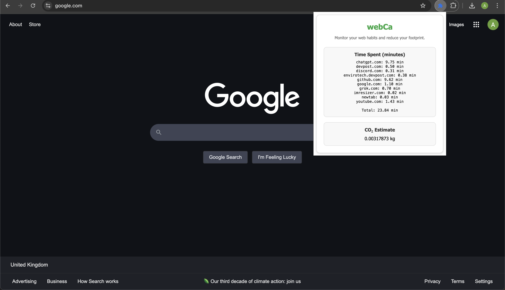

# 🌱 webCa - Web Habit Tracker & Carbon Footprint Estimator  

**webCa** is a browser extension that helps you monitor your online activity, estimate its environmental impact, and encourage greener browsing habits through challenges and insights.  

## 🚀 Features  

- **📊 Real-Time Activity Tracking** – Monitors time spent on websites and categorizes them (e.g., social media, video streaming).  
- **♻️ Live CO₂ Estimation** – Estimates carbon emissions based on browsing time using generalized industry data.  
- **🏆 Eco Challenges & Gamification** – Encourages behavior change with daily goals and rewards.  
- **📈 User-Friendly Dashboard** – Displays tracked data with a clean and responsive UI.  
- **🔒 Privacy-Focused** – Works entirely on the client side with no data collection.  

## 📷 Preview  

  
*A sleek, modern UI with real-time tracking and insights.*  

## 🛠 Installation  

1. **Download the extension files** or clone this repository:  
   ```sh  
   git clone https://github.com/heyaryx/webca.git  
   ```  
2. Open Chrome and navigate to `chrome://extensions/`.  
3. Enable **Developer Mode** (toggle in the top right).  
4. Click **Load unpacked** and select the project folder.  
5. The extension will now be available in your browser! 🎉  

## 🏗 How It Works  

- The extension tracks time spent on websites using the **Chrome Extensions API**.  
- It categorizes websites (e.g., YouTube as "Video", Twitter as "Social").  
- CO₂ emissions are estimated based on rough industry averages.  
- The popup displays live stats with a **modern UI**.  

## 🛠 Tech Stack  

- **JavaScript** (for tracking and calculations)  
- **Chrome Extensions API** (for monitoring web activity)  
- **Local Storage** (to save user data)  
- **HTML/CSS** (for the popup UI)  

## 🔜 Future Improvements  

- 📌 More **detailed CO₂ calculations** using real-time energy grid data.  
- 🔗 **Integration with user accounts** for progress tracking.  
- 🎯 More **eco-friendly challenges** and reward systems.  

## 💡 Why webCa?  

Digital activities consume energy, but most people are unaware of their impact. **webCa** makes it easy to understand and reduce your **digital carbon footprint**—one habit at a time. 🌍  

## 💚 Contribute & Support  

Want to contribute? Feel free to **fork this repo**, submit **issues**, or suggest **features**. Let's build a greener web together! 🌱  

📩 **Contact**: heyaryx@gmail.com  
🔗 **GitHub**: [github.com/heyaryx/webca](https://github.com/heyaryx/webca)  

## 🤝 License  

This project is licensed under the **MIT License** – see the [LICENSE.md](LICENSE.md) file for details.  
